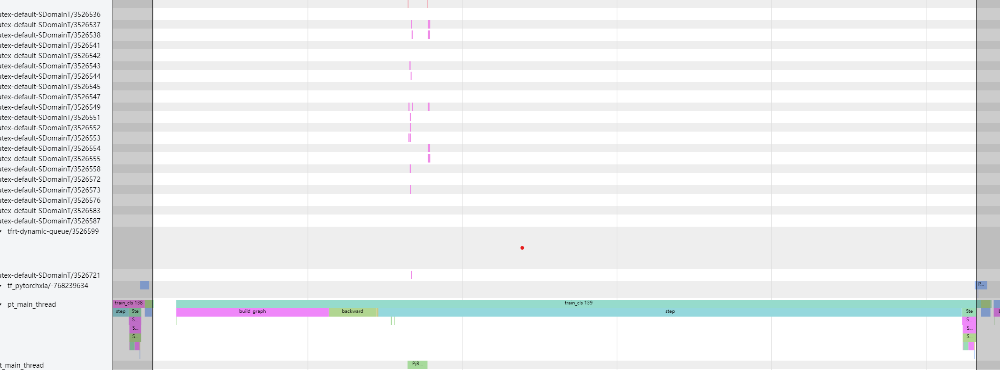

### AdamW extremely slow when model/bsz is small

I found that in torch_xla, AdamW is extremely slow even when the model is small. Specifically, it's the `optimizer.step` that's taking a long time. For a small 5.8M model (which is basically nothing), `optimizer.step` takes ~0.2s on a TPU v4-8. 

A minimal reproducible example is in `test_mp_opt.py`. To run it, simply do `python test_mp_opt.py`. It will train this small model on 1k image data for 1 epoch with a local batch size of 8. On a v4-8, the speed is around 4.2it/s, which is extremely slow. I split `xm.optimizer_step(optimizer)` into `xm.reduce_gradients(optimizer)` and `optimizer.step()` to exclude the time of reducing gradients. 

I also profile the performance using `torch_xla.debug.profiler` to further investigate the issue. Change `tracing=True` in `test_mp_opt.py` to enable profiling. I've attached the profiling result in `./profile/` folder and they can be viewed using tensorboard by running `tensorboard --logdir ./profile/`.
Also `torch_xla.debug.profiler` seems to be a bit outdated and cannot be correctly viewed as said in the tutorial, please install `tensorboard-plugin-profile==2.8.0` (an earlier version) to view the profiling result correctly. The tracing result is in the trace viewer panel in the profile.

As shown below, the `optimizer.step` (torch.optim.AdamW) is taking the majority of the time for a single iteration. Ideally it should take far less time than the forward and backward pass as it's simple operation of updating the weights. I also tried a few other variants of the optimizer: `torch_xla.amp.syncfree.AdamW`, `torch_xla.distributed.zero_redundancy_optimizer.ZeroRedundancyOptimizer` and they are nowhere faster. Traditional optimization approaches like foreach and fused AdamW seems not supported at all in torch_xla.

If this problem is authentic (that I'm not doing anything wrong), I think it would be better to add some optimization for AdamW in torch_xla. It's a very common optimizer and should be optimized for better performance. 

